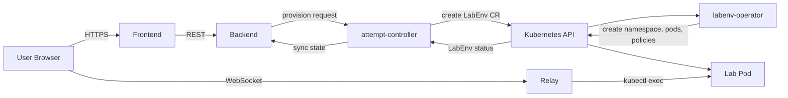

# Rootenv

> Self-hosted platform for on-demand, isolated Linux learning environments on Kubernetes. Runs on your own cluster, light on resources, with no external dependencies — bring your own labs and own your data.

Rootenv provisions ephemeral lab environments on demand — each lab runs fully isolated, accessible through a browser-based terminal with built-in task tracking. Drop it onto a k3s cluster, add your own labs, and run a full Linux training platform on hardware you control.

<!-- TODO: add demo.gif here -->

## What it does

- Click a lab → get a fully provisioned environment in seconds
- Each lab is fully isolated: dedicated namespace, network policies, resource quotas
- Access via browser-based terminal — no local setup required
- Labs are defined declaratively in YAML and loaded into the platform
- Environments self-destruct after configurable TTL

## Architecture

Rootenv consists of the following services:

- **frontend** — web UI for browsing labs and launching environments
- **backend** — REST API and lab metadata store (PocketBase)
- **attempt-controller** — creates `LabEnv` custom objects in Kubernetes when a lab is provisioned, then syncs their status back to the database
- **labenv-operator** — watches `LabEnv` objects and reconciles the underlying Kubernetes resources (namespace, pods, network policies, etc.)
- **relay-exec** — WebSocket-to-kubectl-exec bridge enabling browser-based terminal access to lab containers
- **relay-authenticator** - lightweight middleware for authenficationg and authorizing relay access requests
- **task-control** -  automated task completion tracking

See [docs/architecture.md](docs/architecture.md) for detailed design and trade-offs.



## Tech stack

- **Kubernetes** — orchestration and isolation primitives (namespaces, NetworkPolicies, RBAC, ResourceQuotas)
- **Go** — all the services
- **PocketBase** — `backend` (embedded DB + REST API)
- **Vue.js** — `frontend` (JS)
- **Skaffold + k3d** — local development workflow

## Quickstart

### Remote (K3S)

Prerequisites:
- (https://opentofu.org/docs/intro/install/)[`opentofy`]
- (https://kubernetes.io/docs/tasks/tools/install-kubectl-linux/)[`kubectl`]
- (https://helm.sh/docs/intro/install/)[`helm`]

```bash
# Make secrets
cp scripts/.env.example scripts/.env
vi scripts/.env

cp infra/terraform/environments/sandbox/terraform.tfvars.example infra/terraform/environments/sandbox/terraform.tfvars
vi infra/terraform/environments/sandbox/terraform.tfvars

PASS=password123
kubectl create secret generic attempt-controller-secrets -n rootenv-infra --from-literal ATTEMPT_CONTROLLER_BACKEND_USERNAME=attempt-controller@example.local --from-literal ATTEMPT_CONTROLLER_BACKEND_PASSWORD=$PASS --dry-run=client -o yaml > deploy/base/50-attempt-controller-secrets.yaml

# Bootstrap k3s cluster

cd infra/terraform/environments/sandbox
tofu init
tofu apply

# Use the provisioned kubeconfig

export KUBECONFIG=/home/alex/.kube/rootenv-sandbox

# Install platform components

make sandbox-platform-deploy

# Deploy app

make sandbox-deploy

# Bootstrap users

make dbusers-init

# Upload lab definitions

make labs-sync

```

### Remote development (K3S + Skaffold )

Prerequisites:
- (https://opentofu.org/docs/intro/install/)[`opentofy`]
- (https://kubernetes.io/docs/tasks/tools/install-kubectl-linux/)[`kubectl`]
- (https://helm.sh/docs/intro/install/)[`helm`]

```bash
# Generate github token
# GitHub -> Settings -> Developer Settings -> Personal Access Tokens
# Required permissions: write:packages, repo
echo "TOKEN" | docker login ghcr.io -u alex-sviridov --password-stdin
# Make skaffold secrets
cp .env.example .env
vi .env

# Make secrets
cp scripts/.env.example scripts/.env
vi scripts/.env

cp infra/terraform/environments/sandbox/terraform.tfvars.example infra/terraform/environments/sandbox/terraform.tfvars
vi infra/terraform/environments/sandbox/terraform.tfvars

PASS=password123
kubectl create secret generic attempt-controller-secrets -n rootenv-infra --from-literal ATTEMPT_CONTROLLER_BACKEND_USERNAME=attempt-controller@example.local --from-literal ATTEMPT_CONTROLLER_BACKEND_PASSWORD=$PASS --dry-run=client -o yaml > deploy/base/50-attempt-controller-secrets.yaml

# Bootstrap k3s cluster

cd infra/terraform/environments/sandbox
tofu init
tofu apply

# Use the provisioned kubeconfig

export KUBECONFIG=/home/alex/.kube/rootenv-sandbox

# Install platform components

make sandbox-platform-deploy

# Deploy app

make sandbox

# Bootstrap users

make dbusers-init

# Upload lab definitions

make labs-sync

```

### Local development (K3D + Skaffold)

Prerequisites: 
 - Docker
 - [k3d](https://k3d.io)
 - [Skaffold](https://skaffold.dev)
 - `kubectl`
 - `make`

```bash
# Make secrets
cp scripts/.env.example scripts/.env
vi scripts/.env 

PASS=password123
kubectl create secret generic attempt-controller-secrets -n rootenv-infra --from-literal ATTEMPT_CONTROLLER_BACKEND_USERNAME=attempt-controller@example.local --from-literal ATTEMPT_CONTROLLER_BACKEND_PASSWORD=$PASS --dry-run=client -o yaml > deploy/base/50-attempt-controller-secrets.yaml

# Provision a local k3d cluster, apply manifests
make dev-cluster

# Open the UI
open http://localhost/

# For active development with hot apply and hot rebuild
make dev-polling

# After a cluster restart (e.g. after a reboot), just start it back up — no rebuild needed:

make k3d-run
```


## Repository layout

```
.
├── services/        # platform services 
├── deploy/          # Kubernetes manifests and deployment configs
├── infra/           # Terraform infrastructure configuration
├── labs/            # lab definitions (YAML) and lab base images
│   ├── definitions/ # YAML lab definitions to be loaded into the backend
│   └── images/      # Dockerfiles for lab base images
├── scripts/         # operational scripts
├── docs/            # architecture and operational documentation
├── skaffold.yaml    # development workflow
```

## Status

This is an active personal project exploring patterns in self-service infrastructure, multi-tenant isolation on Kubernetes, and ephemeral environment management. Not production-hardened.

## Roadmap

Tracked in [GitHub Issues](../../issues). Major directions:

- VM-based labs with Kata Containers
- Lab content for variosus certification tracks
- Hybrid deployment model: on-prem Kubernetes runtime with AWS-based backup, observability, and DR
- Terraform modules for repeatable infrastructure provisioning
- Centralized observability via Prometheus + Grafana

## License

[GNUv3](LICENSE)