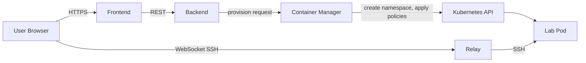

# Rootenv

> Self-service platform for on-demand, isolated Linux learning environments on Kubernetes.

Rootenv provisions ephemeral lab environments — each lab runs in an isolated Kubernetes namespace, accessible through a browser-based SSH terminal. Built for hands-on learning of Linux administration, RHCSA/RHCE preparation, and similar certification tracks.

<!-- TODO: add demo.gif here -->

## What it does

- Click a lab → get a fully provisioned environment in seconds
- Each lab is fully isolated: dedicated namespace, network policies, resource quotas
- Access via browser-based SSH terminal — no local setup required
- Labs are defined declaratively in YAML and loaded into the platform
- Environments self-destruct after configurable TTL

## Architecture


Rootenv consists of four services:

- **backend** — REST API and lab metadata store (PocketBase)
- **contmgr** — Kubernetes controller responsible for lab lifecycle: provisioning namespaces, applying isolation policies, enforcing TTL
- **relay** — SSH-to-WebSocket bridge enabling browser-based terminal access to lab containers
- **frontend** — web UI for browsing labs and launching environments

See [docs/architecture.md](docs/architecture.md) for detailed design and trade-offs.



## Tech stack

- **Kubernetes** — orchestration and isolation primitives (namespaces, NetworkPolicies, RBAC, ResourceQuotas)
- **Go** — `contmgr` and `relay` services [CHECK — really Go?]
- **PocketBase** — `backend` (embedded DB + REST API)
- **Vue.js** — `frontend` (JS)
- **Skaffold + k3d** — local development workflow

## Quickstart

Prerequisites: Docker, [k3d](https://k3d.io), [Skaffold](https://skaffold.dev), `kubectl`, `make`.

```bash
# Create local cluster
k3d cluster create --config k3d.yaml

# Run platform with hot reload
skaffold dev

# Load lab definitions into the backend
make load-labs

# Open the UI
open http://localhost:[CHECK port]
```

See [docs/development.md](docs/development.md) for detailed development setup.

## Repository layout

```
.
├── services/        # platform services (backend, contmgr, frontend, relay)
├── deploy/          # Kubernetes manifests and deployment configs
├── labs/            # lab definitions (YAML) and lab base images
│   ├── definitions/ # YAML descriptors loaded into the backend
│   └── images/      # Dockerfiles for lab base images
├── scripts/         # operational scripts
├── docs/            # architecture and operational documentation
└── skaffold.yaml    # development workflow
```

## Status

This is an active personal project exploring patterns in self-service infrastructure, multi-tenant isolation on Kubernetes, and ephemeral environment management. Not production-hardened — see [Limitations](#limitations).

## Limitations

- Single-cluster deployment; no HA control plane
- Namespace-level isolation only (no VM-grade boundaries — labs must be considered semi-trusted)
- No persistent state for labs across restarts
- [CHECK — что ещё знаешь честно]

## Roadmap

Tracked in [GitHub Issues](../../issues). Major directions:

- Hybrid deployment model: on-prem Kubernetes runtime with AWS-based backup, observability, and DR
- Terraform modules for repeatable infrastructure provisioning
- Centralized observability via Prometheus + Grafana
- Lab content for additional certification tracks

## License

[GNUv3](LICENSE)