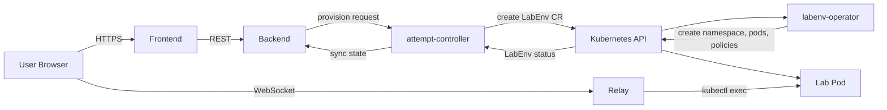

# Rootenv

> Self-service platform for on-demand, isolated Linux learning environments on Kubernetes.

Rootenv provisions ephemeral lab environments — each lab runs in an isolated Kubernetes namespace, accessible through a browser-based SSH terminal. Built for hands-on learning of Linux administration, RHCSA/RHCE preparation, and similar certification tracks.

<!-- TODO: add demo.gif here -->

## What it does

- Click a lab → get a fully provisioned environment in seconds
- Each lab is fully isolated: dedicated namespace, network policies, resource quotas
- Access via browser-based terminal — no local setup required
- Labs are defined declaratively in YAML and loaded into the platform
- Environments self-destruct after configurable TTL

## Architecture


Rootenv consists of five services:

- **backend** — REST API and lab metadata store (PocketBase)
- **attempt-controller** — creates `LabEnv` custom objects in Kubernetes when a lab is provisioned, then syncs their status back to the database
- **labenv-operator** — watches `LabEnv` objects and reconciles the underlying Kubernetes resources (namespace, pods, network policies, etc.)
- **relay** — WebSocket-to-kubectl-exec bridge enabling browser-based terminal access to lab containers
- **frontend** — web UI for browsing labs and launching environments

See [docs/architecture.md](docs/architecture.md) for detailed design and trade-offs.



## Tech stack

- **Kubernetes** — orchestration and isolation primitives (namespaces, NetworkPolicies, RBAC, ResourceQuotas)
- **Go** — `attempt-controller`, `labenv-operator`, and `relay` services
- **PocketBase** — `backend` (embedded DB + REST API)
- **Vue.js** — `frontend` (JS)
- **Skaffold + k3d** — local development workflow

## Quickstart

### Remove

Prerequisites: `opentofy`, `kubectl`.

```bash
# Make secrets
cp scripts/.env.example scripts/.env
vi scripts/.env

cp infra/terraform/environments/sandbox/terraform.tfvars.example infra/terraform/environments/sandbox/terraform.tfvars
vi infra/terraform/environments/sandbox/terraform.tfvars

kubectl create secret generic attempt-controller-secrets -n rootenv-infra --from-literal ATTEMPT_CONTROLLER_BACKEND_USERNAME=attempt-controller@example.local --from-literal ATTEMPT_CONTROLLER_BACKEND_PASSWORD=password123 --dry-run=client -o yaml > deploy/base/50-attempt-controller-secrets.yaml

# Bootstrap k3s cluster

cd infra/terraform/environments/sandbox
tofu init
tofu apply

# Use the provisioned kubeconfig

export KUBECONFIG=/home/alex/.kube/rootenv-sandbox

# Install platform components

make sandbox-platform-deploy

# Deploy app

make sandbox-deploy

# Bootstrap users

make dbusers-init

# Upload lab definitions

make labs-sync

```

### Locally

Prerequisites: 
 - Docker
 - [k3d](https://k3d.io)
 - [Skaffold](https://skaffold.dev)
 - `kubectl`
 - `make`

```bash
# Make secrets
cp scripts/.env.example scripts/.env
vi scripts/.env 
kubectl create secret generic attempt-controller-secrets -n rootenv-infra --from-literal ATTEMPT_CONTROLLER_BACKEND_USERNAME=attempt-controller@example.local --from-literal ATTEMPT_CONTROLLER_BACKEND_PASSWORD=password123 --dry-run=client -o yaml > deploy/base/50-attempt-controller-secrets.yaml

# Create cluster, apply manifests
make dev-cluster

# Start the skaffold for auto applying manifest changes and rebuilding containers
make dev

# Seed the database: create superuser and service accounts
make dev-dbusers-init

# Build lab images

make labs-build

# Load lab definitions into the backend
make labs-sync

# Open the UI
open http://localhost:8080
```

After a cluster restart (e.g. after a reboot), just start it back up — no rebuild needed:

```bash
make k3d-run
```

For active development with hot reload:

```bash
make dev   # starts the cluster then runs skaffold dev
```

## Repository layout

```
.
├── services/        # platform services (backend, attempt-controller, labenv-operator, frontend, relay)
├── deploy/          # Kubernetes manifests and deployment configs
├── labs/            # lab definitions (YAML) and lab base images
│   ├── definitions/ # YAML descriptors loaded into the backend
│   └── images/      # Dockerfiles for lab base images
├── scripts/         # operational scripts
├── docs/            # architecture and operational documentation
├── skaffold.yaml    # development workflow
└── scripts/         # management scripts and goodies
```

## Status

This is an active personal project exploring patterns in self-service infrastructure, multi-tenant isolation on Kubernetes, and ephemeral environment management. Not production-hardened — see [Limitations](#limitations).

## Limitations

- Single-cluster deployment; no HA control plane
- Namespace-level isolation only (no VM-grade boundaries — labs must be considered semi-trusted)
- No persistent state for labs across restarts
- Images lost on full cluster recreate (`make cluster`) — re-push with `skaffold build && make push-latest`

## Roadmap

Tracked in [GitHub Issues](../../issues). Major directions:

- VM-based labs with Kata Containers
- Lab content for variosus certification tracks
- Hybrid deployment model: on-prem Kubernetes runtime with AWS-based backup, observability, and DR
- Terraform modules for repeatable infrastructure provisioning
- Centralized observability via Prometheus + Grafana

## License

[GNUv3](LICENSE)