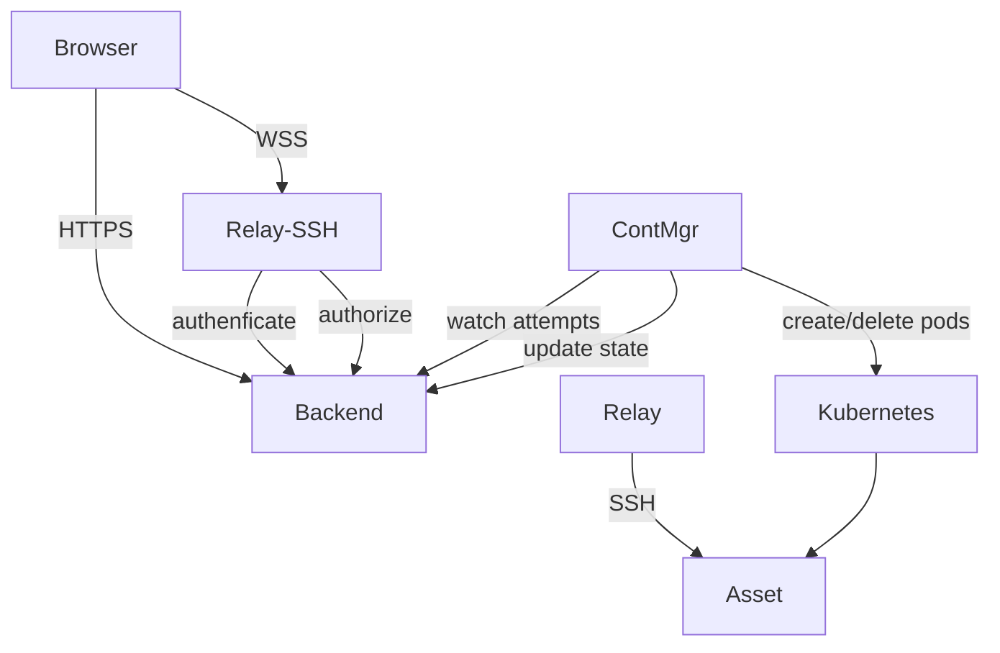

# Architecture

Rootenv is a web platform for interactive Linux learning. The platform provides a wrapper around Kubernetes cluster, allowing users browsing lab exercises, request an isolated ephemeral lab environment, and interact with it through a browser terminal.

## Components

| Service | Tech | Responsibility |
|---|---|---|
| Frontend | Vue.js | UI — browse labs, terminal, lab content |
| Backend | PocketBase | Auth, lab catalog, attempt records, command queue |
| Relay | Go | WebSocket-to-SSH proxy; validates sessions via Backend |
| ContMgr | Go (controller-runtime) | Kubernetes controller — provisions/decommissions lab pods |
| Labs | YAML files | Lab definitions synced into Backend on startup |

## Diagram

## Key Flows

**Provision a lab**
1. User clicks "Start" → Frontend calls Backend to create an `attempt` record.
2. ContMgr watches for new attempts and provisions a Kubernetes pod for the lab.
3. Backend stores the pod address in the attempt record.

**Connect to terminal**
1. Frontend opens a WebSocket to Relay-SSH, passing the session token.
2. Relay-SSH validates the token with Backend and resolves the target pod address.
3. Relay-SSH pipes the WebSocket to an SSH connection on the lab pod.

**Decommission**
1. User clicks "Stop" (or a new provision is requested — only one active attempt allowed).
2. Backend marks the attempt as decommissioned.
3. ContMgr deletes the pod and updates the attempt record.

## Security Boundaries

- **Relay-SSH is the only component that opens SSH connections.** No other service touches lab pods over SSH.
- **`environment` field in lab YAML is never sent to the frontend.** It contains server/image definitions used only by ContMgr.
- **ContMgr has scoped RBAC** — it can only manage pods in the `labs` namespace.
- Session tokens are validated on every Relay connection, not cached.

## Deployment

Runs on Kubernetes (k3d for local dev). Stateful components: Backend (PocketBase with a PVC). Stateless and horizontally scalable: Frontend, Relay, ContMgr.

Lab definitions live in the repo under `labs/` and are synced into PocketBase manually. Subdirectory = group; filename (no extension) = slug.
